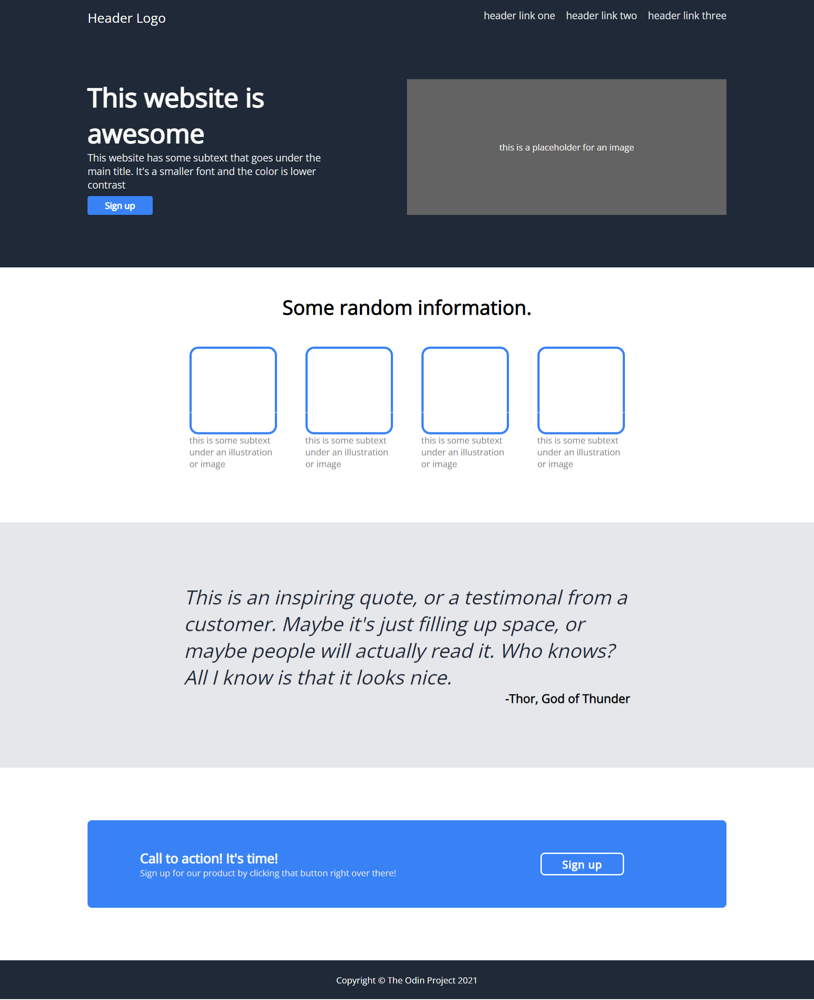

# Oding Project - Landing Page project.

This project is from the Odin Project. The objective of this project is copying a provided design using HTML & CSS.
Responsiveness was not an objective and has not been considered in this project.

## Final Result
Some of the padding and margins are a bit off, but the overall design was captured. 

## Provided Design and Style guide
### Design

### Style Guide

